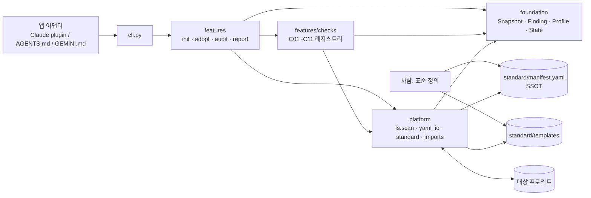
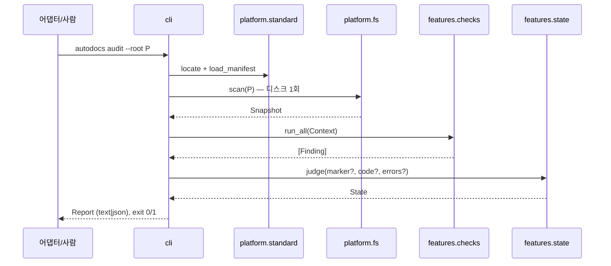

# 아키텍처 설계서 — autodocs

> 갱신 시점: 계층·모듈 책임·데이터 흐름 변경. 단순 함수 추가는 갱신 대상이 아니다.

## 시스템 구성도

## 컴포넌트 책임

| 컴포넌트 | 계층 | 책임 |
|---|---|---|
| `foundation/types.py` | L0 | 계약: Snapshot, Finding, Profile, Context, Report, State, Severity |
| `foundation/errors.py` | L0 | 엔진 예외 (CLI 가 exit 2 로 매핑) |
| `platform/fs.py` | L1 | `scan(root)` — os.walk 한 번으로 Snapshot 생성. 파일 쓰기 (`write_text` 는 덮어쓰지 않음) |
| `platform/standard.py` | L1 | manifest 위치 탐색(--standard/env 는 폴백 없음 → 소스 체크아웃 → 패키지 동봉본)과 로드 |
| `platform/manifest_schema.py` | L1 | manifest 구조·enum·참조·값 타입 검증. 실패는 ManifestInvalid 하나로 |
| `foundation/paths.py` | L0 | `norm_rel`(상대 경로 정규형), `safe_path`(심링크 목적지가 root 안일 때만 허용) |
| `platform/imports.py` | L1 | 소스에서 import 문자열 추출 (Python ast, TS/C# 정규식) |
| `features/layout.py` | L2 | manifest + profile → 이 프로젝트에 요구되는 구체 경로 (문서, 디렉터리, 계층) |
| `features/profile.py` | L2 | `.standard/project.yaml` 읽기·검증·쓰기 |
| `features/state.py` | L2 | 마커·코드·error 유무 → 4상태 판정 |
| `features/checks/` | L2 | 검사 레지스트리. manifest 선언 순서로 실행, severity 는 manifest 값 사용. `structure.Resolver` 가 preset.import_roots 기준으로 import 를 계층에 매핑 |
| `features/init.py` | L2 | 디렉터리·문서·포인터·마커 생성 |
| `features/adopt.py` | L2 | init + 미분류 소스 목록을 PROP-000 계획서로 |
| `features/audit.py` | L2 | scan → profile → checks → judge |
| `features/report.py` | L2 | text / json 렌더링 |
| `cli.py` | 진입점 | argparse. 판단 없음 |

## 데이터 흐름

## 설계 원칙

- **SSOT**: 규칙은 manifest 에만. 코드는 manifest 를 해석할 뿐 규칙을 갖지 않는다.
- **O(n)**: 파일 시스템은 명령당 한 번 스캔. 파일 내용은 필요한 check 만, 파일당 한 번 읽는다.
- **엔진은 판단하지 않는다**: 결정론적 생성·검증만. 분류·작성은 AI/사람 (adopt 계획서, 템플릿의 TODO).
- **비파괴**: init/adopt 는 기존 파일을 덮어쓰지 않는다.
- **하향 의존만**: L0 는 표준 라이브러리만, L1 은 L0 만, L2 는 L1·L0. C05 가 자기 자신에게도 적용된다.

## 계층 매핑

- L0: `src/autodocs/foundation/`
- L1: `src/autodocs/platform/`
- L2: `src/autodocs/features/`
- L3: `src/autodocs/customization/` (현재 비어 있음)

---
표준: AI Harness Engineering Standard v0.1.0
