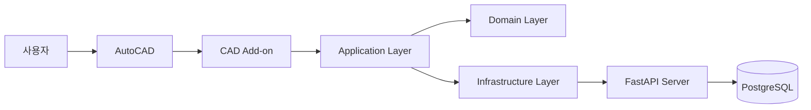
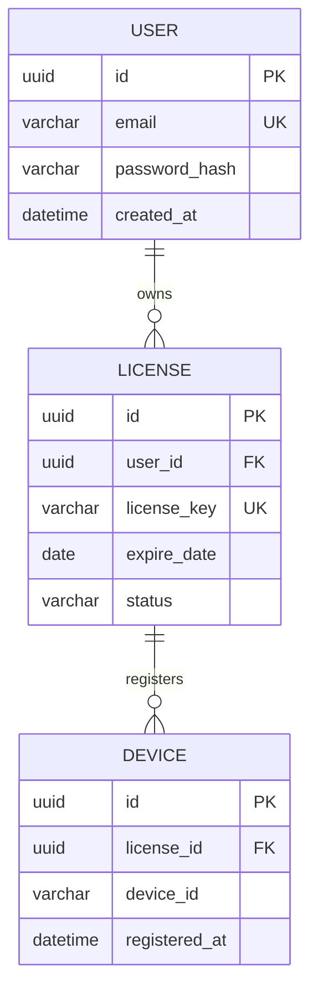
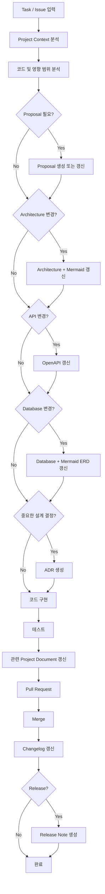

# AI Harness Engineering - Documentation Standard

## 1. 목적

본 문서는 AI Harness Engineering 환경에서 프로젝트 문서를 일관된 기준으로 생성·갱신하기 위한 문서 표준을 정의한다.

기본 원칙은 다음과 같다.

- 사람은 **요구사항과 변경 의도**를 정의한다.
- AI는 작업 내용을 분석하여 **필요한 문서를 판단하고 자동 생성·갱신**한다.
- 모든 프로젝트 문서는 Markdown 기반으로 관리한다.
- 시스템 아키텍처와 ERD는 **Mermaid**를 사용한다.
- API 명세는 **OpenAPI**를 기준으로 관리한다.
- 문서는 GitHub에서 코드와 함께 버전 관리한다.
- 작업마다 모든 문서를 갱신하지 않고, **변경 영향이 있는 문서만 갱신**한다.

---

# 2. 문서 생명주기 (Document Lifecycle)

| 문서 | 생성 시점 | 갱신 시점 | 종료/보관 시점 | 표준 표현 방식 | 관리 목적 |
|---|---|---|---|---|---|
| **프로젝트 개요 (README)** | 프로젝트 생성 시 | 프로젝트 목적, 실행 방법, 주요 기능 변경 시 | 프로젝트 종료 시 | Markdown | 프로젝트의 진입점 제공 |
| **요구사항 명세서 (Requirement)** | 프로젝트 시작 시 | 요구사항 추가·수정·삭제 시 | 프로젝트 종료 시 | Markdown | 무엇을 구현해야 하는지 정의 |
| **아키텍처 설계서 (Architecture)** | 초기 시스템 구조 설계 시 | 시스템 구조, 모듈 관계, 외부 연동 구조 변경 시 | 프로젝트 종료 시 | Markdown + **Mermaid** | 시스템 구조와 책임 관계 시각화 |
| **API 명세서 (API)** | API 최초 설계 시 | Endpoint, Request, Response, 인증 방식 변경 시 | 프로젝트 종료 시 | **OpenAPI** | 시스템 간 인터페이스를 기계 판독 가능한 형태로 정의 |
| **데이터베이스 설계서 (Database)** | 데이터 모델 최초 설계 시 | Table, Column, Relation, Index 변경 시 | 프로젝트 종료 시 | Markdown + **Mermaid ERD** | 데이터 구조 및 관계 정의 |
| **기능·변경 제안서 (Proposal)** | 기능 또는 변경 제안이 필요한 작업 생성 시 | 제안 내용 또는 요구사항 변경 시 | 작업 완료 후 기록으로 보관 | Markdown + 필요 시 이미지/Mermaid/MVP | 변경 의도 및 검토 내용 공유 |
| **아키텍처 의사결정 기록 (ADR)** | 중요한 기술·구조적 의사결정 발생 시 | 결정 내용 보완 또는 상태 변경 시 | 영구 보관 | Markdown | 왜 해당 결정을 했는지 기록 |
| **배포 노트 (Release Note)** | Release 준비 시 | Release 포함 항목 변경 시 | 해당 버전 기록으로 보관 | Markdown | 사용자 및 운영자에게 변경사항 전달 |
| **변경 이력 (Changelog)** | 프로젝트 생성 시 | Merge 또는 Release 시 | 프로젝트 종료까지 누적 | Markdown | 프로젝트 전체 변경 이력 추적 |

---

# 3. 문서 분류

```text
Project Documents
├── README
├── Requirement
├── Architecture
├── API
└── Database

Task Documents
└── Proposal

Decision Documents
└── ADR

Release Documents
├── Release Note
└── Changelog
```

---

# 4. 권장 디렉터리 구조

```text
project/
├── README.md
│
├── docs/
│   ├── requirements/
│   │   └── requirements.md
│   ├── architecture/
│   │   └── architecture.md
│   ├── api/
│   │   └── openapi.yaml
│   ├── database/
│   │   └── database.md
│   ├── proposals/
│   │   ├── PROP-001.md
│   │   └── PROP-002.md
│   ├── adr/
│   │   ├── ADR-001.md
│   │   └── ADR-002.md
│   └── releases/
│       ├── v1.0.0.md
│       └── v1.1.0.md
│
└── CHANGELOG.md
```

---

# 5. 문서별 표준 및 예시

## 5.1 프로젝트 개요 (README)

### 역할

프로젝트를 처음 접하는 사람과 AI가 가장 먼저 확인하는 문서다.

### 예시

```markdown
# CAD Add-on

## 프로젝트 목적

AutoCAD에서 반복적으로 수행되는 작업을 자동화하여
설계 업무의 생산성을 향상한다.

## 주요 기능

- 레이어 자동 정리
- 블록 관리
- 도면 검사
- 데이터 추출

## 기술 스택

- C#
- .NET
- AutoCAD .NET API
- FastAPI
- PostgreSQL
```

### AI 갱신 기준

- 프로젝트 목적 변경
- 주요 기능 추가·삭제
- 실행 방법 변경
- 핵심 기술 스택 변경
- 문서 진입 경로 변경

단순 내부 구현 변경만으로는 갱신하지 않는다.

---

## 5.2 요구사항 명세서 (Requirement)

### 역할

시스템이 **무엇을 해야 하는지** 정의한다.

### 예시

```markdown
# 요구사항 명세서

## REQ-001 레이어 자동 정리

### 목적

사용자가 반복적으로 수행하는 레이어 변경 작업을 자동화한다.

### 요구사항

1. 사용자는 정리 대상 객체를 선택할 수 있어야 한다.
2. 시스템은 설정된 레이어 규칙을 읽어야 한다.
3. 객체 종류에 따라 지정된 레이어로 이동해야 한다.
4. 변경된 객체 수를 사용자에게 표시해야 한다.
5. 작업은 Undo가 가능해야 한다.
```

### AI 갱신 기준

- 새로운 요구사항 추가
- 기존 요구사항 변경
- 요구사항 삭제
- 사용자 요구 또는 업무 규칙 변경

---

## 5.3 아키텍처 설계서 (Architecture)

### 역할

시스템의 주요 컴포넌트와 책임, 데이터 흐름 및 의존성을 설명한다.

아키텍처 구조는 **Mermaid를 표준 시각화 방식으로 사용한다.**

### 예시



### 설계 원칙 예시

- Domain은 AutoCAD API에 직접 의존하지 않는다.
- 외부 시스템 접근은 Infrastructure를 통해 수행한다.
- CAD 종속 영역과 비즈니스 로직을 분리한다.

### AI 갱신 기준

- Layer 추가·삭제
- Module 책임 변경
- 외부 시스템 연동 구조 변경
- 주요 데이터 흐름 변경
- 공통 모듈 구조 변경

단순 클래스 추가 또는 작은 기능 구현은 아키텍처 변경으로 간주하지 않는다.

---

## 5.4 API 명세서 (OpenAPI)

### 역할

시스템 간 통신 규격을 정의한다.

API 명세는 Markdown에 Request/Response를 중복 작성하기보다 **OpenAPI를 Single Source of Truth로 사용한다.**

권장 파일:

```text
docs/api/openapi.yaml
```

### 예시

```yaml
openapi: 3.1.0

info:
  title: CAD Add-on API
  version: 1.0.0

paths:
  /api/license/verify:
    post:
      summary: 라이선스 검증
      operationId: verifyLicense

      requestBody:
        required: true
        content:
          application/json:
            schema:
              type: object
              required:
                - deviceId
                - licenseKey
              properties:
                deviceId:
                  type: string
                licenseKey:
                  type: string

      responses:
        "200":
          description: 라이선스 검증 성공
          content:
            application/json:
              schema:
                type: object
                properties:
                  valid:
                    type: boolean
                  expireDate:
                    type: string
                    format: date

        "401":
          description: 유효하지 않은 라이선스
```

### AI 갱신 기준

- Endpoint 추가·삭제
- Request/Response Schema 변경
- 인증 방식 변경
- 오류 Response 변경
- API 구현과 OpenAPI 간 불일치 발생

---

## 5.5 데이터베이스 설계서 (Database)

### 역할

데이터 구조, 테이블 책임, 관계 및 주요 제약조건을 정의한다.

ERD는 **Mermaid ER Diagram**을 표준으로 사용한다.

### 예시



### 테이블 설명 예시

| Column | Type | Constraint | Description |
|---|---|---|---|
| id | UUID | PK | 사용자 ID |
| email | VARCHAR | UNIQUE | 로그인 이메일 |
| password_hash | VARCHAR | NOT NULL | 암호화된 비밀번호 |
| created_at | DATETIME | NOT NULL | 생성 일시 |

### AI 갱신 기준

- Table 추가·삭제
- Column 추가·삭제·타입 변경
- Relation 변경
- Primary/Foreign Key 변경
- 주요 Index 또는 Constraint 변경

---

## 5.6 기능·변경 제안서 (Proposal)

### 역할

타인의 프로젝트 또는 기존 기능에 새로운 아이디어나 변경사항을 제안할 때 사용한다.

Proposal은 모든 구현 작업에 필수로 생성하지 않는다.

### 사용 권장 상황

- 다른 사람이 담당하는 기능 변경
- UI/UX 변경
- 기존 업무 프로세스 변경
- 여러 Module에 영향을 주는 기능
- 구현 전에 의견 수렴이 필요한 아이디어

### 예시

```markdown
# PROP-003 레이어 자동 정리 기능 추가

## 제안 배경

현재 사용자가 객체별 레이어를 수동으로 변경하고 있어
반복 작업이 발생한다.

## 제안 내용

선택된 객체를 사전에 정의된 규칙에 따라
자동으로 적절한 레이어로 이동하는 기능을 추가한다.

## 기대 효과

- 반복 작업 감소
- 도면 작성 규칙 일관성 향상
- 사용자 실수 감소

## 예상 영향 범위

- Layer Module
- Ribbon UI
- Project Layer Rule

## 참고 자료

- Screenshot
- Mermaid Diagram
- Figma
- 간단한 MVP / Prototype
- Video
```

### AI 갱신 기준

Proposal은 구현 자체가 아니라 **논의와 합의를 위한 변경 의도 기록**이다.

승인된 Proposal은 이후 Issue 또는 Task와 연결할 수 있다.

---

## 5.7 아키텍처 의사결정 기록 (ADR)

### 역할

중요한 기술적 또는 구조적 선택과 그 이유를 기록한다.

### 생성이 필요한 예

- 새로운 Framework 도입
- Database 변경
- 인증 방식 변경
- 프로젝트 구조 변경
- 핵심 통신 방식 변경
- 공통 Module 설계 변경

### 생성하지 않는 예

- 변수명 변경
- 단순 UI 수정
- 작은 버그 수정
- 기존 구조 내 기능 추가

### 예시

```markdown
# ADR-001 FastAPI 기반 인증 서버 사용

## Status

Accepted

## Context

CAD Add-on에서 사용자 및 라이선스를 검증하기 위한
인증 서버가 필요하다.

## Decision

기존 FastAPI 서버에 인증 기능을 통합한다.

## Reason

- 기존 인프라 재사용 가능
- 별도 서버 운영 비용 감소
- Python 기반 서비스와 통합 용이

## Alternatives

### 별도 Spring Boot 서버

장점
- 기존 Java 개발 경험 활용 가능

단점
- 새로운 서버 운영 필요
- 인증 정보 연동 복잡도 증가

## Consequences

FastAPI 서버 장애가 인증 기능에도 영향을 줄 수 있으므로
서비스 안정성 관리가 필요하다.
```

---

## 5.8 배포 노트 (Release Note)

### 역할

특정 Release에서 사용자 또는 운영자가 알아야 하는 변경사항을 제공한다.

### 예시

```markdown
# Release v1.2.0

Release Date: 2026-09-11

## Added

- 레이어 자동 정리 기능
- 레이어 규칙 설정 기능

## Changed

- 로그인 처리 속도 개선

## Fixed

- 특정 환경에서 라이선스 검증이 실패하는 문제 수정
```

### AI 갱신 기준

Release 대상 Commit, PR, Issue를 분석하여 자동 생성하는 것을 권장한다.

---

## 5.9 변경 이력 (Changelog)

### 역할

프로젝트의 주요 변경사항을 시간순으로 누적 관리한다.

### 예시

```markdown
# Changelog

## [1.2.0] - 2026-09-11

### Added

- Layer Cleanup 기능
- Layer Rule 설정

### Changed

- Login 처리 개선

### Fixed

- License Validation 오류 수정
```

### AI 갱신 기준

PR Merge 또는 Release를 기준으로 자동 갱신한다.

---

# 6. AI 문서 관리 Workflow

AI Harness는 새로운 Task를 받았다고 해서 모든 문서를 수정하지 않는다.

변경 내용을 분석하고 영향을 받는 문서만 선택적으로 생성·갱신한다.



---

# 7. 문서 영향 판단 예시

## 예시 1. Ribbon 버튼 위치 변경

```text
README           변경 없음
Requirement      변경 없음
Architecture     변경 없음
OpenAPI          변경 없음
Database         변경 없음
Proposal         필요 시
ADR              불필요
Changelog        갱신
```

## 예시 2. 신규 License API 추가

```text
README           필요 시 갱신
Requirement      갱신
Architecture     구조 변경이 있는 경우 갱신
OpenAPI          반드시 갱신
Database         DB 변경 시 갱신
Proposal         논의가 필요한 경우 생성
ADR              인증 구조 변경 시 생성
Changelog        갱신
```

## 예시 3. PostgreSQL에서 다른 Database로 전환

```text
README           기술 스택 갱신
Requirement      일반적으로 변경 없음
Architecture     갱신
OpenAPI          일반적으로 변경 없음
Database         반드시 갱신
Proposal         사전 논의용으로 권장
ADR              반드시 생성
Changelog        갱신
```

---

# 8. AI Harness 기본 규칙

AI Agent 또는 Coding Agent는 작업 시작 시 다음 순서를 따른다.

```text
1. README 확인
2. Project Context 확인
3. Requirement 확인
4. Architecture 확인
5. 관련 ADR 확인
6. 현재 Task / Issue 분석
7. 영향 범위 판단
8. 필요한 문서 식별
9. 구현
10. 테스트
11. 관련 문서 갱신
12. 변경 내역 검증
13. PR 생성
```

## AI가 지켜야 하는 원칙

### 1. 문서를 무조건 생성하지 않는다.

변경과 관련 있는 문서만 생성하거나 갱신한다.

### 2. 코드와 문서를 함께 변경한다.

코드와 문서가 서로 다른 상태로 유지되지 않도록 한다.

### 3. 구조는 Mermaid를 우선한다.

Architecture와 ERD는 가능한 한 Mermaid를 사용하여
GitHub에서 코드와 함께 diff 및 versioning이 가능하도록 한다.

### 4. API는 OpenAPI를 기준으로 한다.

API 설명을 여러 Markdown 파일에 중복 작성하지 않는다.

OpenAPI를 API 계약의 Single Source of Truth로 사용한다.

### 5. 중요한 결정은 ADR로 남긴다.

최종 결과만 기록하지 않고 선택 이유와 대안을 함께 기록한다.

### 6. Proposal은 선택적이다.

모든 구현에 Proposal을 강제하지 않는다.

논의·합의·시각적 설명이 필요한 변경에 활용한다.

### 7. 문서는 현재 상태를 표현해야 한다.

현재 프로젝트 상태는 Project Document에 반영하고,
과거 변경은 ADR, Changelog, Git History에서 추적한다.

---

# 9. 핵심 원칙

> 사람은 요구사항과 의도를 정의하고,  
> AI는 구현과 함께 프로젝트 문서를 지속적으로 최신 상태로 유지한다.

본 표준의 목적은 문서의 양을 늘리는 것이 아니다.

**코드, 문서, 설계, 의사결정이 서로 일치하는 상태를 AI Harness를 통해 자동으로 유지하는 것**이 핵심이다.
