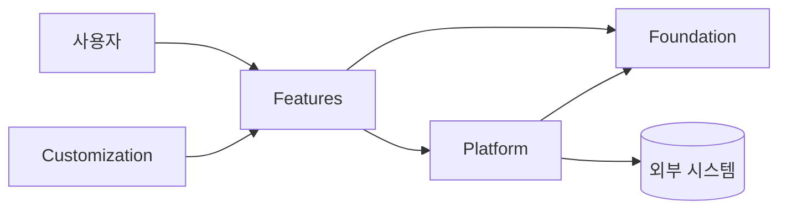

# 아키텍처 설계서 — $project_name

> 주요 컴포넌트와 책임, 데이터 흐름, 의존성. 구조는 Mermaid 로 그린다.
> 갱신 시점: Layer 추가·삭제, Module 책임 변경, 외부 연동 구조 변경, 주요 데이터 흐름 변경.
> 단순 클래스 추가·작은 기능 구현은 갱신 대상이 아니다.

## 시스템 구성도

## 컴포넌트 책임

| 컴포넌트 | 계층 | 책임 |
|---|---|---|
| _이름_ | L2 | _무엇을 담당하는가_ |

## 데이터 흐름

_주요 시나리오 1~2개를 sequenceDiagram 또는 문장으로._

## 설계 원칙

- Foundation 은 상위 계층을 알지 않는다.
- 외부 시스템 접근은 Platform 을 통해서만 한다.
- 비즈니스 로직은 Features 에, 프로젝트별 차이는 Customization 에 둔다.

## 계층 매핑

$layer_dirs

---
표준: AI Harness Engineering Standard v$standard_version
