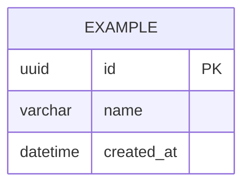

# 데이터베이스 설계서 — $project_name

> 데이터 구조, 테이블 책임, 관계, 제약조건. ERD 는 Mermaid erDiagram.
> 갱신 시점: Table/Column 추가·삭제·타입 변경, Relation·Key·Index·Constraint 변경.

## ERD

## 테이블 설명

### EXAMPLE

| Column | Type | Constraint | Description |
|---|---|---|---|
| id | UUID | PK | 식별자 |
| name | VARCHAR | NOT NULL | 이름 |
| created_at | DATETIME | NOT NULL | 생성 일시 |

## 제약조건

_유니크, 체크, 외래키 정책(ON DELETE 등)._

## 인덱스

| 테이블 | 인덱스 | 컬럼 | 목적 |
|---|---|---|---|

---
표준: AI Harness Engineering Standard v$standard_version
